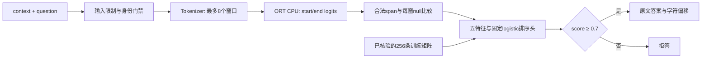

# Bounded QA: system and evidence / 有限 QA 系统与证据

输入为用户提供的英文原文和问题；输出为原文精确片段及偏移，或拒答。核心工程问题是分开验证运行成本、候选答案正确性、拒答覆盖与可复现性。当前是单机 CPU 研究原型，没有并发服务或生产部署验收。

Input: an English supplied passage and question. Output: an exact source span with offsets, or abstention. The implementation separates inference cost, candidate correctness, answer coverage and reproducibility. It is a local CPU research prototype, with no production-service claim.

## Follow one request / 跟踪一次请求



初始化还核验冻结协议、校准选择、全部质量证据和本地资产身份。推理不接收gold标签、不在线拟合、不调整阈值。图中的训练矩阵仅用于初始化时重建排序头；与每条请求的token矩阵不同。

Initialization verifies the fixed protocol, calibration selection, complete evidence and local asset identity. Gold labels never enter request inference. Training-only head reconstruction occurs at initialization, with no online fitting or threshold adaptation.

| 层 / Layer | 输入、输出与合同 / Contract | 实现与检查 / Implementation |
|---|---|---|
| 模型准备 | 固定revision→FP32/INT8 ONNX与哈希；QA projection保持FP32 | [prepare_qa_specialist_assets](../experiments/prepare_qa_specialist_assets.py)，[上游身份](../configs/qa-specialist/upstream.json) |
| 本地运行时 | 两个字符串→各窗口start/end logits；单窗输入张量`[1,L]`，两个输出均`[1,L]`，`L≤384`；四CPU线程 | [qa_specialist_runtime](../lab/qa_specialist_runtime.py)，[运行时测试](../tests/test_qa_specialist_runtime.py) |
| 解码 | 合法context span；最多30 tokens；按每窗span减本窗null选候选；输出Python字符偏移`[start,end)` | [extractive_qa](../lab/extractive_qa.py)，[边界测试](../tests/test_extractive_qa.py) |
| 特征与排序 | 每请求五维向量`[5]`→一个排序分数；训练矩阵`[256,5]`、标签`[256]`，仅训练集拟合scaler | [qa_risk_calibration](../lab/qa_risk_calibration.py)，[固定训练协议](../configs/qa-risk/study.json) |
| 拒答与失败分类 | 固定阈值0.7；恰好context/question字段；模型/证据错误失败关闭，非法输入与低分拒答分开 | [serve_qa_specialist](../experiments/serve_qa_specialist.py)，[入口测试](../tests/test_serve_qa_specialist.py) |
| 完整性与复现 | 原始logits、特征、标签、协议→独立重算与存档head重建；不把旧summary直接当真 | [verify_qa_risk](../experiments/verify_qa_risk.py)，[verify_release_rc4](../experiments/verify_release_rc4.py) |

基础模型及量化kernel由上游提供；本项目没有训练RoBERTa或实现ORT整数kernel。项目实现的范围是固定实验、解码/身份合同、监督排序集成、失败路径和可审计记录。

## Engineering decisions / 实现取舍

| 决策 | 为什么选择 | 代价与验证边界 |
|---|---|---|
| 提供原文，抽取精确span | 输出可定位到输入；便于检查offset与逐token行为 | 原文中的合法片段仍可能答非所问，必须单独验EM/F1；不等同开放域问答 |
| 动态INT8，projection保留FP32 | 固定量化方案，直接实测CPU成本 | 整数图不是加速证明；基础固定负载约1.33×，质量非劣失败仍保留 |
| 用每窗span/null margin | 明确窗口聚合和null基准 | 不是官方pipeline行为复刻；多窗口max可能放大错误候选分数 |
| 固定五特征logistic排序 | 用旧开发材料训练小head，将正确性排序与基础模型分开 | score不是正确概率保证；0.7只在固定校准规则下选择，分布迁移可能失效 |
| 启动时完整证据核验 | 防止未经核验的head/selection开启回答 | 历史启动约18.04秒；热请求69.600ms不含这项成本；未做多用户服务 |
| 从存档训练矩阵重建 | 完整核对raw后重放同一浮点输入，与运行时一致 | 不证明任意平台从新生浮点矩阵训练都收敛；保留原收敛门槛和失败 |

## Evidence that supports each claim / 每项结论的证据

| 结论 | 可直接检查的证据 | 不可推出的结论 |
|---|---|---|
| 基础FP32/INT8 72.052/54.188ms | [6进程240条原始测量](../results/qa-specialist-performance-v1)，[独立重算](../results/qa-specialist-review-v1/performance/audit.py) | 不能套用到含排序链路、并发服务或其它硬件 |
| 完整INT8排序链路69.600ms | [3进程120条测量](../results/qa-risk-performance-v1)，[独立重算](../results/qa-risk-review-v1/risk-performance-audit.py) | 不是新FP32对照，不是TTFT、生成速度或线上SLO |
| 27/27接受答案正确，覆盖27/64 | [128题原始logits和结果](../results/qa-risk-v2/evaluation-int8)，[完整验证器](../experiments/verify_qa_risk.py) | 不是128题全对，不是总体90%正确率保证；system EM/F1为91/128 |
| 有明显覆盖损失 | [文章级审计](../results/qa-risk-review-v1/evaluation-independent.json) | Civil_disobedience全32题拒答；37个可回答拒答中19个raw答案正确，不能称高覆盖 |
| 量化回退与专用QA v1失败 | [原确认](../results/qwen-confirmation-v1)，[specialist v1](../results/qa-specialist-v1) | 后续排序门槛通过不撤销历史失败；没有新量化非劣证明 |

## Reproduce without changing the study / 不改实验的复现

```bash
python -m pip install numpy==2.2.6
python -m experiments.review_qa_evidence --output-dir runs/my-evidence-review
```

报告先执行完整RC4验收，保留全部历史负结果，再输出紧凑中英双语表格。记录源码/输入摘要、Git身份或无Git状态、失败原因和输出哈希；拒绝覆盖已有目录。它不是一套新的独立算法验证器，而是已有完整验收的可读入口。CI在Python3.11/3.12执行相同命令；实际模型推理需要另外安装固定依赖与准备本地资产。

[无Git使用与依赖](release-reproduction.md)提供七条真实功能/故障演示。新读者先检查已验证材料，再运行本地模型；不要为了演示改阈值，也不要把公开样本重跑称为新确认。

## Remaining boundaries / 剩余边界

研究材料可以发布，同时保留失败；这不要求把项目改造成生产QA。公开访问与根代码许可证仍由所有者决定；验收命令不检查GitHub当前状态、不授予许可、不发布。

The release scope is reproducible research, including negative results. Publishing it does not establish production QA, novel quantization kernels, cross-device speedup. Access and root-license decisions remain separate from technical verification.
