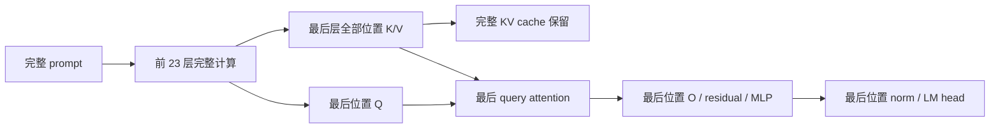

# Last-position prefill / 最后位置需求裁剪

本节点进入 Transformer 内部计算图：保留全层、全位置 KV，只计算最终生成位置所需的最后层输出。固定四臂研究中，相对原完整路径更快，但相对最强对照未达到预注册收益门槛。因此保留为实验实现，**没有启用为默认优化；research.3 仅收录可复现的研究实现与负结果**。

This study prunes unused final-block computations for last-position causal generation while retaining every layer's complete KV cache. One preregistered four-arm experiment passed its output checks but missed its required speedup over the strongest control. The implementation remains experimental and disabled by default. Research.3 includes its source and reproducible negative result; research.2 remains unchanged.

## Mechanism / 机制与范围

已有 runtime 对整个 prompt 调用固定版本 Qwen2，随后只消费最后位置 logits。由于后续生成只依赖每层历史 K/V，最后一层旧位置的 Q、attention 输出、O projection、MLP、最终 norm/head 不会影响所需输出。前 23 层仍需完整计算，以产生正确的后续层输入。



[实现](../lab/qwen_demand_prefill.py)只支持固定 Qwen2、batch=1、无 padding 的普通因果推理、tied embedding 与普通浮点 KV。拒绝外部 mask、input embeddings、旋转/量化/异常 cache。已有历史 cache 长度为 P、新输入长度为 N 时，K 的 RoPE 起点仍是 P，最后 Q 的位置为 P+N−1。后续单 token decode 全部使用原模型路径。未修改 QA 服务、阈值、模型权重或上游安装源码。

减少张量位置数是数学依赖结论，不是硬件执行时间的证明。GEMM/GEMV 与不同 attention shape 可能选择不同 kernel、产生不同浮点舍入，因此这里不称全输入逐位等价。也不把 Python shape trace 当 GPU profiler。

## Controls and preregistration / 强对照与预注册

[协议](../configs/qwen-demand-prefill/study.json)先由 `2de6219` 提交；预审在任何模型实验之前依次补充聚合算术、九份上游源码 hash、原始逐 token 时间和失败处理策略。最终协议 SHA256：`a087cc0a5ab44e8faa7dc38c56cb2a049f9f4403ccc954596619ac06db89c0f2`。实际运行源码提交为 `afeabfca70830a955b6f8730f69745d6d4bd35aa`。

|Arm|实际操作|用途|
|---|---|---|
|full|原模型整段前向，最后取所需 logits|已存在完整路径|
|head_only|完整 decoder，先截取最后 hidden，再算 LM head|已知优化消融|
|split_last|先处理 N−1 token 且只求值 KV，再用原模型处理最后 token|较强需求裁剪对照|
|final_query|前 23 层不变，最后层只保留所需 Q/O/MLP/norm/head，全 KV 保留|唯一预指定候选|

只裁剪 LM head 是已有 `logits_to_keep` 机制，不是本项目原创；参见 [Transformers Qwen2 文档](https://huggingface.co/docs/transformers/v4.50.0/model_doc/qwen2)。安装版 MLX-LM 的先行 prefill 分块只求值 KV，惰性执行已经能消去无用尾部计算；本研究没有把这种路径中的未执行计算算作收益。输入最长 2048，处于所固定上游生成默认分块上限内。这是对固定安装版本的研究，不代表战胜最新推理引擎。

Apple M4 Max Metal GPU；MLX 0.29.3、MLX-LM 0.26.3、Python 3.12.11；Qwen2.5-0.5B 本地 Q8 权重，group64、浮点 KV。两个固定合成文本，长度 64/512/2048，四轮 Latin rotation，每 arm/round 一个新进程，共 16 进程。每种长度两次预热、两条计时输入，强制生成32个 token。整个唯一计时研究用时52.385秒，在900秒预算内；没有计时预跑或重复研究。

每条请求先完成分词、输入求值和空 KV 对象分配，再同步计时。TTFT 到第一个 token 完成；decode 是其后31个间隔；完整32-token计算包含两者。不含加载、分词、网络、排队、JSON或跨请求前缀复用。逐 token 完成时间全部存档。每轮先取两输入中位数，再取四轮中位数；speedup 为相应控制臂与候选的聚合值之比。

## Measurements / 实测结果

以下是各 arm 的模型计算 TTFT，中位数，单位 ms。

|输入 token|full|head_only|split_last|final_query|
|---:|---:|---:|---:|---:|
|64|9.881|8.668|11.719|8.358|
|512|43.086|33.546|35.350|31.586|
|2048（主负载）|175.501|131.941|130.029|124.757|

|2048-token 比较|候选加速比|预定最低值|更快轮数|结果|
|---|---:|---:|---:|---|
|vs full|1.406742×|1.10×|4/4|通过|
|vs head_only|1.057584×|1.05×|4/4|通过|
|vs split_last|**1.042259×**|**1.05×**|4/4|**失败**|

其余短输入、decode 和一致性门槛通过，但联合门槛要求全部通过。不能把接近门槛当成通过、删掉强对照或改用其他 arm 宣布成功。研究到此停止，不扫描形状、重跑或调阈值。

2048-token 完整32-token模型计算为 full **295.896 ms**、head_only **249.171 ms**、split_last **246.978 ms**、候选 **239.982 ms**。这里的总时间与 TTFT 是不同计时范围；由于分别聚合，表中组件中位数不必相加等于总中位数，独立核验检查的是每条原始记录。

同一请求范围的 MLX peak active 为 full **1.961 GiB**、head_only **1.421 GiB**、split_last **1.431 GiB**、候选 **1.420 GiB**，包括模型与临时张量；不是 RSS、设备总内存或 KV 压缩。候选和 head-only 的峰值接近，不能把主要内存收益都归因于最后 query 裁剪。两者 KV 本来相同。decode 代码未优化，其观测波动不独立归因为新的 decode 加速。

## Correctness and numerical evidence / 正确性与数值证据

- 10个输入长度×2种已有cache长度，20个形状场景；每个检查首轮及3步共享token续接，共80条。候选与full的全部24层有效KV字节摘要、形状和offset **80/80相同**，各步top1 **80/80相同**（首轮20、续接60）。
- 候选仅 **64/80** 条 logits 逐位相同，最大绝对差 **0.015625**，最大 RMS 差约 **0.0033643**。这支持“实测输出一致”的有限结论，不支持任意输入无舍入变化。
- 已消耗的74条公开问题，四臂完整greedy token序列全部一致：EM仍为 **18/74=24.3243%**，F1 **29.6778%**。没有新的QA质量确认，也不是原抽取QA的27/128结论。
- 每个arm的24条计时请求（合计96条、每条32token）都与对应full结果一致。不是96个独立业务样本。
- split_last的KV只有16/80条逐位相同，最大logit差0.046875，但本固定工作负载的输出仍相同。这是分块与kernel舍入的另一个对照，不能把所有对照的cache都说成逐位一致。
- 使用独立AutoTokenizer重新生成74份prompt token、解码296份输出并重建6个合成输入全部一致；不加载模型或重测速度。

## Evidence and verification / 证据与复核

[独立摘要](../results/qwen-demand-prefill-v1/summary.json)、[audit](../results/qwen-demand-prefill-v1/audit)、[原始16进程](../results/qwen-demand-prefill-v1/benchmark)保留全部字节。源码/上游/依赖/模型身份、输入token、完整输出、KV摘要、逐token时间和进程顺序均绑定。参数与完整权重不上传。

[无MLX独立核验器](../experiments/verify_qwen_demand_prefill.py)不导入runner，直接校验全文件覆盖、源码和协议身份、模型与进程一致性、ID/shape/offset、32个时间点、输出一致性，重新评分并计算全部门槛。有效负结果返回 `evidence_valid=true, accepted=false`；证据损坏则报错。CI专门要求保留该失败门槛。

```bash
# No model, GPU or MLX required; do not rerun the completed timing study.
python -m experiments.verify_qwen_demand_prefill \
  --audit-root results/qwen-demand-prefill-v1/audit \
  --benchmark-root results/qwen-demand-prefill-v1/benchmark
python -m unittest discover -s tests -p 'test_qwen_demand*.py' -v
```

哈希证明所审记录的一致性，不抵抗同时更改verifier与全部证据的发布者。离线核验不重新执行量化模型或计算完整logits误差；这些数值来自绑定源码的真实audit。四轮、两个合成文本只支持固定工作负载描述，不是统计总体、线上p95、功耗、Linux/GPU横向或手机/NPU结论。

本节点补充的是模型内部依赖分析、图级实现、强对照消融、低精度舍入与成本取舍的实证。上游提供模型、量化与attention kernel，代码与执行有AI辅助；未实现新的低比特kernel、量化算法、蒸馏或论文级创新。历史Qwen量化确认和QA质量失败原样保留。`v0.1.0-research.2` 与默认推理入口未改；`v0.1.0-research.3` 收录 PR #17 的研究实现、原始记录和独立验算，不把未过门槛的候选升级为已接受优化。
